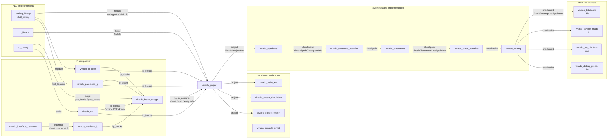
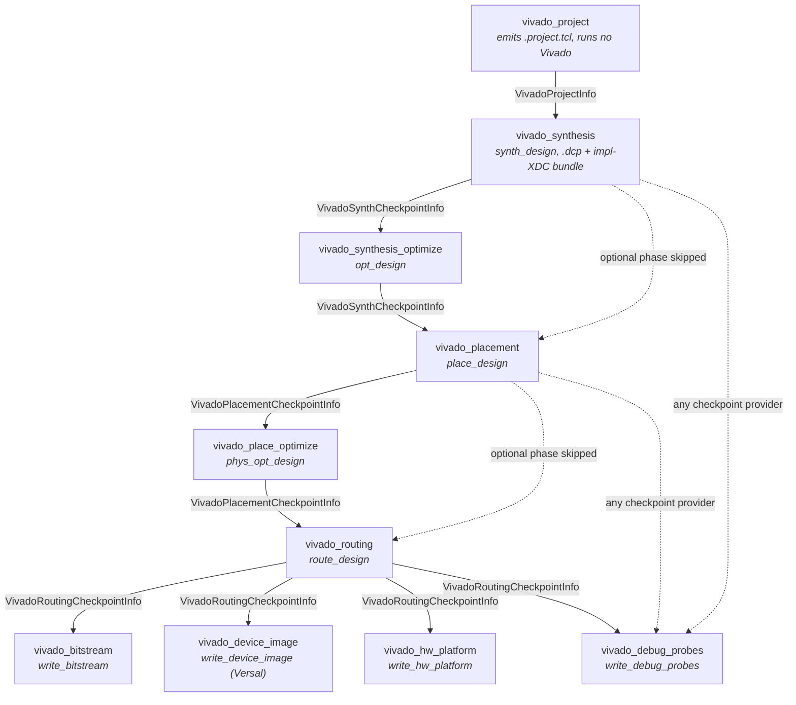
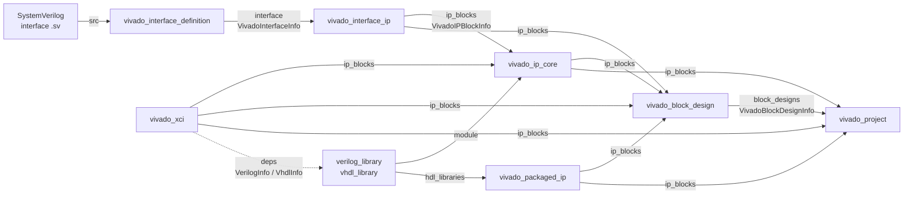
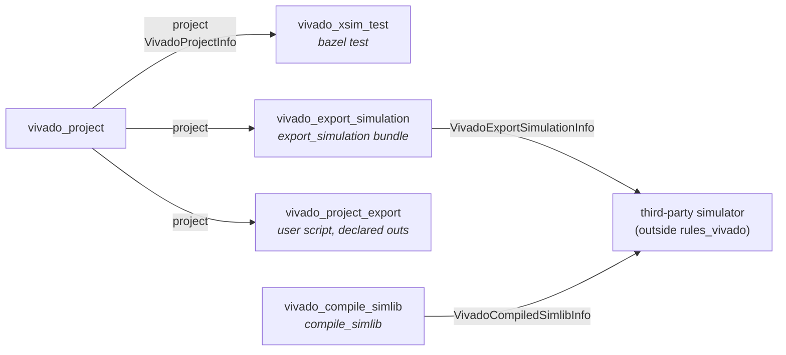

# Rules

Every public rule in `rules_vivado`, grouped by the build phase it
belongs to, with diagrams of how each group connects. All of them
resolve their Xilinx install through a registered
[`vivado_toolchain`](./toolchains.md); that edge is left out of the
diagrams because it reaches every node.

In the diagrams, each box is a rule and each arrow is a Bazel
dependency, labelled with the attribute on the consuming rule and the
provider that crosses it. Boxes outside the dashed groups come from
other rulesets.

## End to end

`vivado_compile_simlib` stands alone: it pre-compiles the Xilinx
simulation libraries for a third-party simulator and hands the result to
whatever consumes a `vivado_export_simulation` bundle, outside this
ruleset.

## Project setup

- [`vivado_project`](./vivado_project.md) — emit a TCL script that
  creates a Vivado project (no Vivado invocation at build time).
  Consumed by `vivado_synthesis`, the simulation rules,
  `vivado_project_export`, and GUI launchers.
- [`xdc_library`](./vivado_xdc_library.md) — bundle constraint files
  with the constraint files they must run after; drops into
  `vivado_project.data`.
- [`vivado_project_export`](./vivado_project_export.md) — open the
  project, source a user `tcl_binary`, and capture the files it writes.

## Project to bitstream

The implementation chain is one rule per Vivado command, and each rule
accepts the provider of the phase before it. The two optimization phases
are optional: `vivado_placement` takes a `VivadoSynthCheckpointInfo`
from either `vivado_synthesis` or `vivado_synthesis_optimize`, and
`vivado_routing` takes a `VivadoPlacementCheckpointInfo` from either
`vivado_placement` or `vivado_place_optimize`.

### Synthesis

- [`vivado_synthesis`](./vivado_synthesis.md) — run synthesis on a
  `vivado_project` and produce a synthesis checkpoint (`.dcp`).
- [`vivado_synthesis_optimize`](./vivado_synthesis.md) — post-synthesis
  optimization pass on a synthesis checkpoint.

### Implementation

- [`vivado_placement`](./vivado_implementation.md) — placement on a
  synthesis checkpoint.
- [`vivado_place_optimize`](./vivado_implementation.md) —
  post-placement optimization on a placement checkpoint.
- [`vivado_routing`](./vivado_implementation.md) — routing on a
  placement checkpoint.

### Hand-off artifacts

- [`vivado_bitstream`](./vivado_bitstream.md) — emit the final `.bit`
  from a routing checkpoint.
- [`vivado_device_image`](./vivado_bitstream.md) — emit a Versal `.pdi`
  from a routing checkpoint.
- [`vivado_hw_platform`](./vivado_hw_platform.md) — emit the `.xsa`
  hardware platform for Vitis / PetaLinux from a routing checkpoint.
- [`vivado_debug_probes`](./vivado_debug_probes.md) — emit the `.ltx`
  probe file for Hardware Manager from any phase checkpoint.

### How the chain connects

Two providers ride along the whole chain rather than crossing a single
edge:

- `VivadoLogInfo` accumulates every upstream phase's `.log` and `.jou`,
  so building `:my_bitstream` with `--output_groups=log` yields the logs
  of synthesis through bitstream.
- `VivadoReportsInfo` maps each phase's `reports` attr to its declared
  report files.

Every phase rule also carries `pre_hooks` and `post_hooks`: `.tcl`,
`.xdc`, `.sdc` files or `tcl_binary` targets sourced inside the Vivado
session before and after the phase's main command.

## IP composition

IP enters a project in two shapes. `VivadoIPBlockInfo` describes a repo
plus, optionally, a configured `.xci` or a VLNV to `create_ip`;
`VivadoBlockDesignInfo` describes a `.bd` and the IP repos it needs.

- [`vivado_xci`](./vivado_ip.md) — configure a Xilinx-catalog IP from a
  `tcl_binary` script into a consumable IP repo. Besides
  `VivadoIPBlockInfo` it exposes `VerilogInfo` and `VhdlInfo`, so it
  can also sit in a `verilog_library`'s `deps` (dashed edge below).
- [`vivado_ip_core`](./vivado_ip.md) — package your own HDL module as a
  reusable Vivado IP core.
- [`vivado_interface_definition`](./vivado_ip.md) — turn a
  SystemVerilog `interface` into IP-XACT bus and abstraction
  definitions.
- [`vivado_interface_ip`](./vivado_ip.md) — register an interface
  definition as an IP catalog entry so block designs can connect to it.
- [`vivado_packaged_ip`](./vivado_packaged_ip.md) — stage an
  already-packaged IP repo for `ip_blocks`.
- [`vivado_block_design`](./vivado_block_design.md) — build a `.bd` from
  a `tcl_binary` script for `vivado_project.block_designs`, forwarding
  the IP repos its cells reference.

Any of these can contribute `project_hooks`: Tcl sourced inside every
downstream `vivado_project` that folds the target in, right after
`create_project`.

## Simulation and export

- [`vivado_xsim_test`](./vivado_simulation.md) — export an xsim bundle
  at build time and run it as a Bazel `test` target, scanning the log
  for error and completion patterns.
- [`vivado_export_simulation`](./vivado_simulation.md) — run
  `export_simulation` for any simulator Vivado supports and stage the
  bundle, stopping there.
- [`vivado_compile_simlib`](./vivado_simulation.md) — pre-compile
  `unisim`, `secureip` and friends for a third-party simulator.
- [`vivado_project_export`](./vivado_project_export.md) — open the
  project, source a user `tcl_binary`, and capture whatever files or
  directories that script writes. Listed under
  [Project setup](#project-setup) too, since it is the general escape
  hatch rather than a simulation rule.

## Toolchain

- [`vivado_toolchain`](./vivado_toolchain.md) — declare a Vivado
  install for toolchain resolution. See
  [Toolchains](./toolchains.md) for the full workflow.

## Providers

- [`VivadoToolchainInfo` and friends](./vivado_providers.md) — the
  providers passed between phases (`VivadoProjectInfo`,
  `VivadoSynthCheckpointInfo`, `VivadoPlacementCheckpointInfo`,
  `VivadoRoutingCheckpointInfo`, `VivadoIPBlockInfo`,
  `VivadoBlockDesignInfo`, `VivadoInterfaceInfo`,
  `VivadoExportSimulationInfo`, and more).
